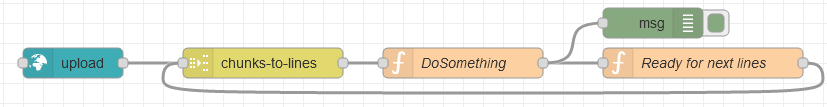
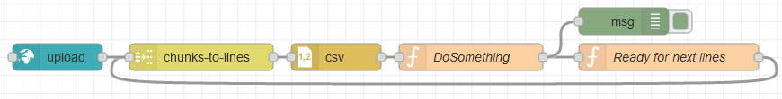

# node-red-contrib-chunks-to-lines
[Node-RED](https://nodered.org) node to read line by line from a stream of chunks of text,
for instance from a [node-red-contrib-ui-upload](https://github.com/alexandrainst/node-red-contrib-ui-upload) widget.

This node takes a stream of chunks of data as input, from which it outputs lines of text in a controlled manner.

There is indeed a built-in back-pressure / flow-control mechanism to optimise buffering and avoid memory exhaustion, by waiting for a <i>tick</i> before sending the next message.

This node is compatible with the conventions used by core nodes such as *split* and *join* to [work with sequences](https://nodered.org/docs/user-guide/messages#message-sequences").
For instance, this node can consume data coming from a [node-red-contrib-ui-upload](https://github.com/alexandrainst/node-red-contrib-ui-upload).

Example: [flow.json](doc/flow.json)

## Input
Each received message is expected to be a chunk of a larger document.

This node expects messages with a `msg.payload` containing either a string (when transmitting ASCII/ANSI text) or TypedArray / Uint8Array (when transmitting multi-byte text such as Unicode UTF-8).

This node will obey the sequence information provided in `msg.parts` and `msg.complete`.

Finally, this node also awaits another type of messages containing a truthy `msg.tick` before releasing the next message.

## Output
This node will output either one line at a time (when n=1 in corresponding option) or an array of lines, in a format (text, CSV, JSON) defined in the options.

The messages will contain updated sequence information in `msg.parts` and `msg.complete`.

Example for CSV processing (splitting a large CSV file as smaller CSV chunks): [flow-csv.json](doc/flow-csv.json)

## Options
* Output <i>n</i> lines at a time:
	* If n = 1, outputs one line at a time. If n ≥ 2, outputs an array of lines (see JSON or text option below).
	* Larger values are useful for instance to insert many lines at a time in an SQL database and increase performance.
* Output format:
	* *Text*: plain format, potentially with multiple lines if the above <i>output</i> option is higher than one.
	* *CSV*: same as *Text* mode but with the first line repeated for each output (useful when CSV column names are provided on the first line), and disabling the `msg.parts` information.
	* *JSON array*: with one line per entry.

* Text decoding (from binary)
	* When the input is received as text, this parameter has no effect.
	* But when the input is received in binary form, this node will have to decode it to text.
	* To do that, the encoding of the original text must be specified (UTF-8, Windows-1252, UTF-16…).
	* If you do not know, leave it to the default UTF-8.

## Backpressure
This node supports *backpressure* / *flow control*:
it can wait for a *tick* before uploading the next chunk of data, to make sure the rest of your Node-RED flow is ready to process more data
(instead of risking an out-of-memory condition), and also conveys this information upstream.

So this node will only output one message at first, and then await a message containing a truthy `msg.tick` before releasing the next message.

To make this behaviour potentially automatic (avoiding manual wires), this node declares its ability by exposing a truthy `node.tickConsumer` for downstream nodes to detect this feature,
and a truthy `node.tickProvider` for upstream nodes.

Likewise, this node detects upstream nodes using the same back-pressure convention, and automatically sends ticks when its internal buffer is getting low, to ask for the next chunk of data.
This is done for instance with the [node-red-contrib-ui-upload](https://github.com/alexandrainst/node-red-contrib-ui-upload) widget.

As a side node, several instances of this node can be chained to test this mechanism.

## Credits
License: [Apache 2.0](LICENSE.md), 2020.

Originally made by [Alexandre Alapetite](https://alexandra.dk/alexandre.alapetite) at the [Alexandra Institute](https://alexandra.dk).
